# PpwAngular

This project was generated using [Angular CLI](https://github.com/angular/angular-cli) version 20.3.6.

## Development server

To start a local development server, run:

```bash
ng serve
```

Once the server is running, open your browser and navigate to `http://localhost:4200/`. The application will automatically reload whenever you modify any of the source files.

## Code scaffolding

Angular CLI includes powerful code scaffolding tools. To generate a new component, run:

```bash
ng generate component component-name
```

For a complete list of available schematics (such as `components`, `directives`, or `pipes`), run:

```bash
ng generate --help
```

## Building

To build the project run:

```bash
ng build
```

This will compile your project and store the build artifacts in the `dist/` directory. By default, the production build optimizes your application for performance and speed.

## Running unit tests

To execute unit tests with the [Karma](https://karma-runner.github.io) test runner, use the following command:

```bash
ng test
```

## Running end-to-end tests

For end-to-end (e2e) testing, run:

```bash
ng e2e
```

Angular CLI does not come with an end-to-end testing framework by default. You can choose one that suits your needs.

## Additional Resources

For more information on using the Angular CLI, including detailed command references, visit the [Angular CLI Overview and Command Reference](https://angular.dev/tools/cli) page.

#

# Práctica 4 - Estilos y Layouts con Tailwind

## Layouts adicionales implementados 
En esta práctica se agregaron cuatro distribuciones adicionales utilizando TailwindCSS para explorar diferentes configuraciones de Grid y FlexBox.

---

# 1. Grid Auto-Fit Responsive

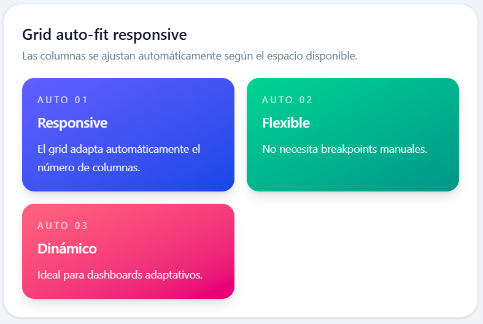

## Explicación:
Este layout utiliza una grilla responsive automática usando `repeat(auto-fit, minmax())`. Las columnas se ajustan automáticamente según el espacio disponible en pantalla, permitiendo que los cards se acomoden dinámicamente sin definir un número fijo de columnas.

## Clases principales utilizadas
* `grid`
* `gap-4`
* `grid-cols-[repeat(auto-fit,minmax(220px,1fr))]`
* `rounded-2xl`
* `bg-linear-to-br`
* `shadow-lg`

---

# 2. Grid con filas personalizadas

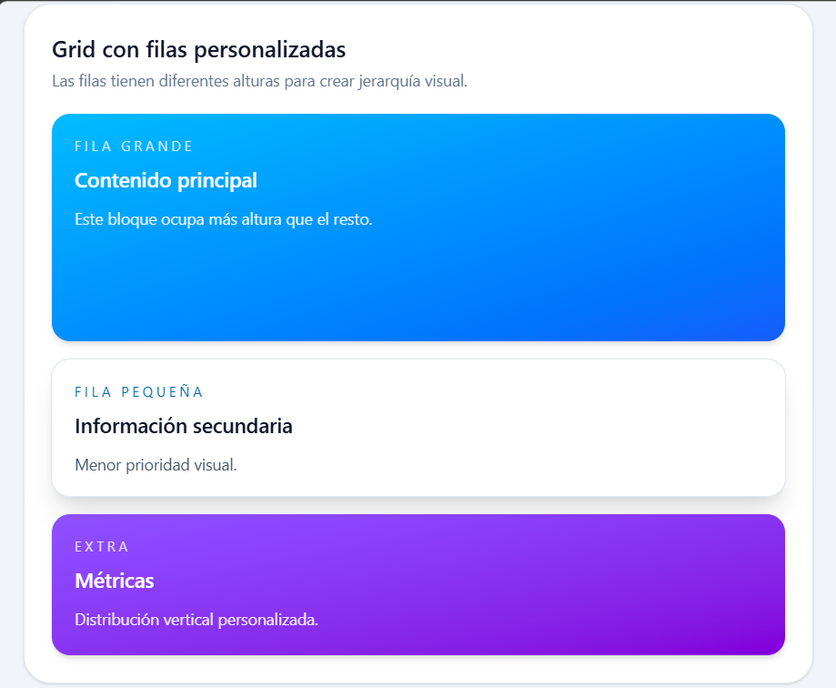

## Explicación

Este layout utiliza filas personalizadas con `grid-rows`.
Permite distribuir contenido verticalmente manteniendo una estructura organizada y uniforme entre cards de diferentes tamaños.

## Clases principales utilizadas

- `grid`
- `md:grid-cols-2`
- `grid-rows-2`
- `gap-4`
- `shadow-md`
- `bg-slate-50`

---

# 3. Flex Responsive Column → Row

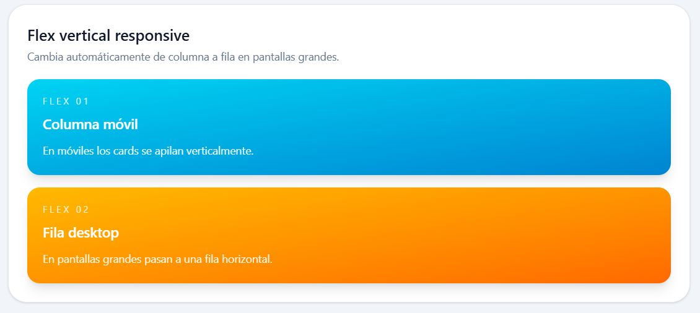

## Explicación

Este layout cambia dinámicamente la dirección del flex según el tamaño de pantalla.
En dispositivos pequeños los elementos se apilan verticalmente (`flex-col`) y en pantallas medianas cambian a distribución horizontal (`md:flex-row`).

## Clases principales utilizadas

- `flex`
- `flex-col`
- `md:flex-row`
- `gap-4`
- `rounded-2xl`
- `shadow-lg`

---

# 4. Flex Reverse Layout

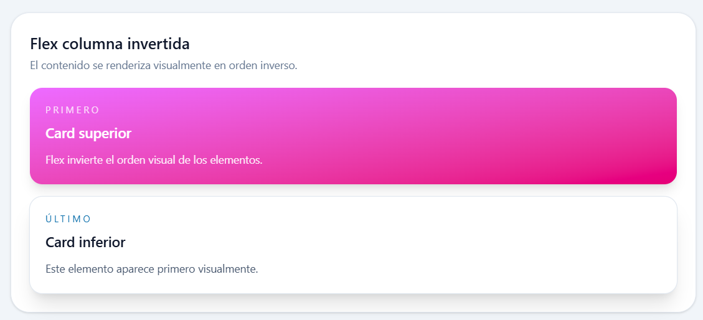

## Explicación

Este layout utiliza `flex-row-reverse` para invertir visualmente el orden de los elementos dentro del contenedor flex.
Es útil para diseños alternados o composiciones visuales dinámicas.

## Clases principales utilizadas

- `flex`
- `flex-row-reverse`
- `gap-4`
- `bg-linear-to-r`
- `shadow-md`
- `rounded-2xl`

--- 

# Práctica 5-A - Formularios Reactivos

## Captura del formulario donde se muestran todos los errores


## Captura del input email con el error de la valicación asincrona
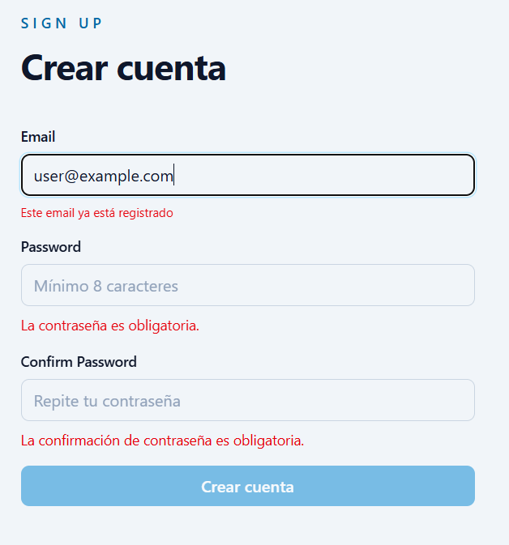

---

# Práctica 5-B - Formularios Reactivos

## Captura del formulario vacío mostrando el estado inicial
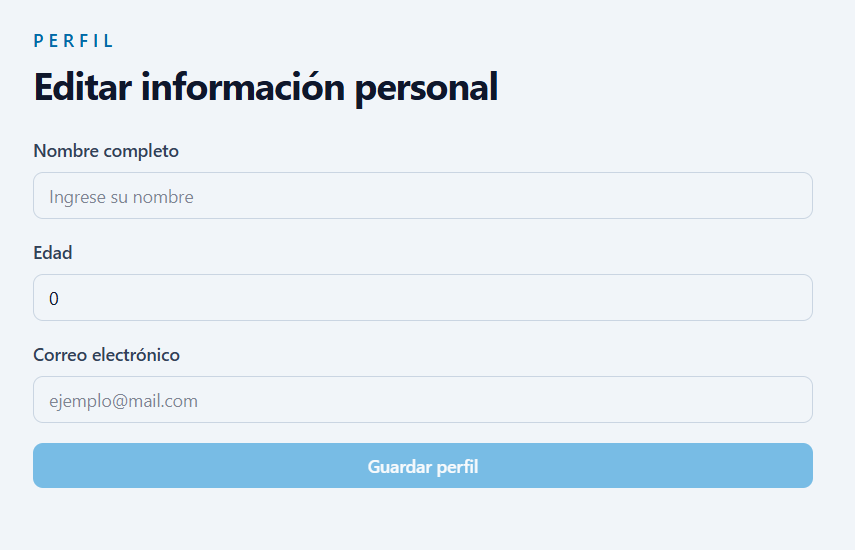

## Captura del formulario con todos los errores visibles (después de submit)
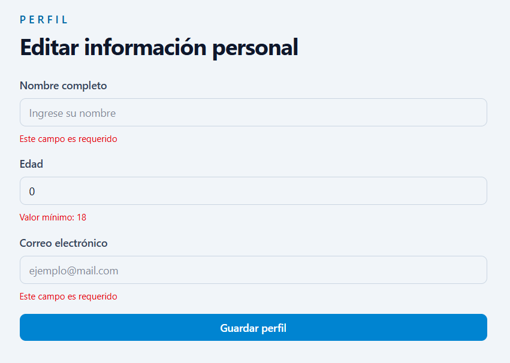

---

# Práctica 5-C - Formularios Reactivos
## Captura del formulario vacío/inicial
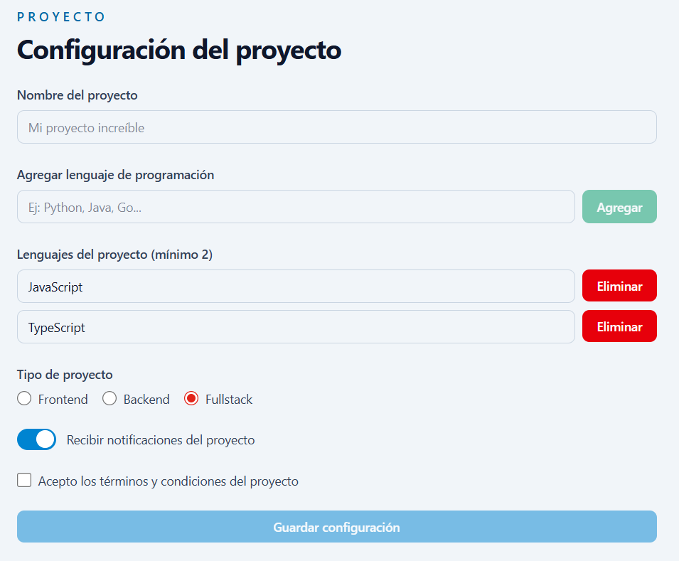

## Captura mostrando todos los errores de validación
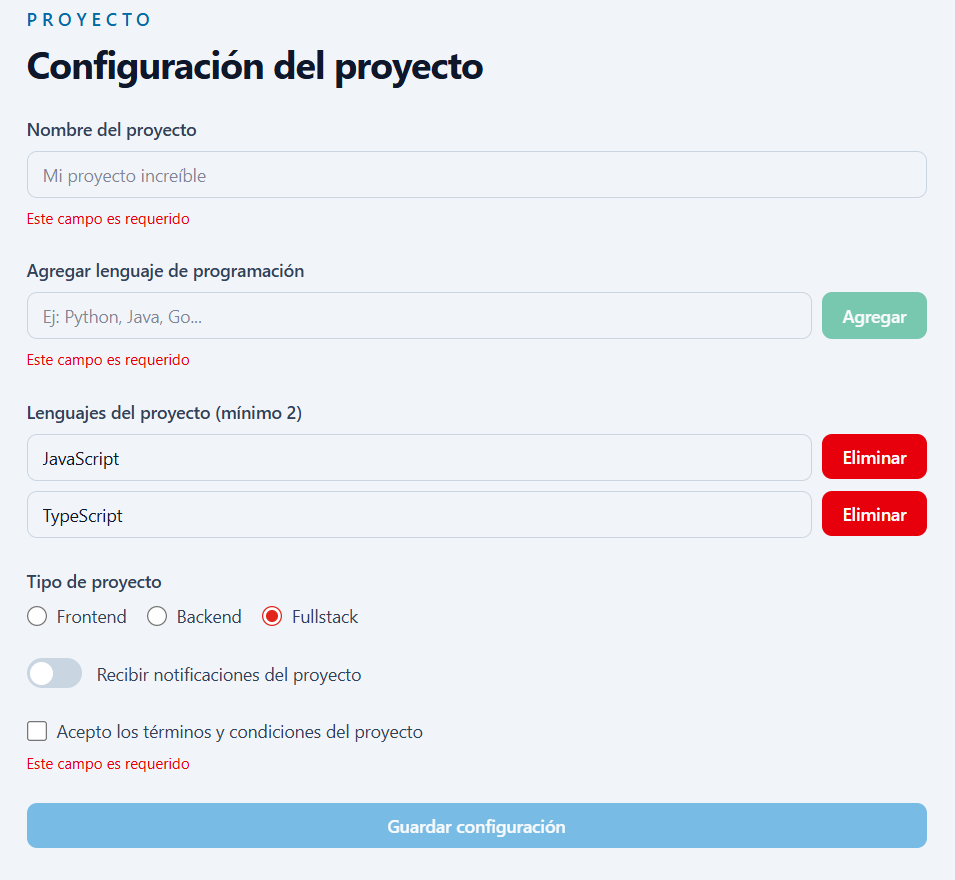

## Captura con el formulario válido y datos completos
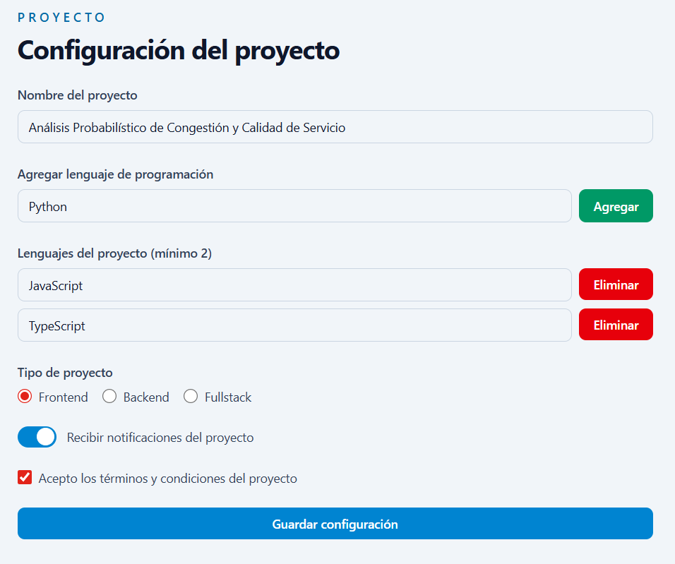

## Captura de consola con el objeto `myForm.value` al hacer submit
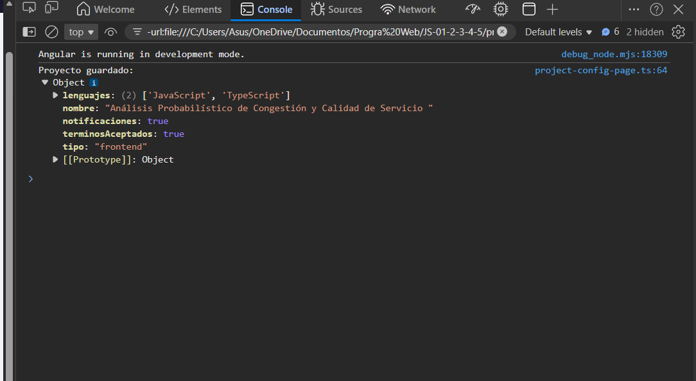